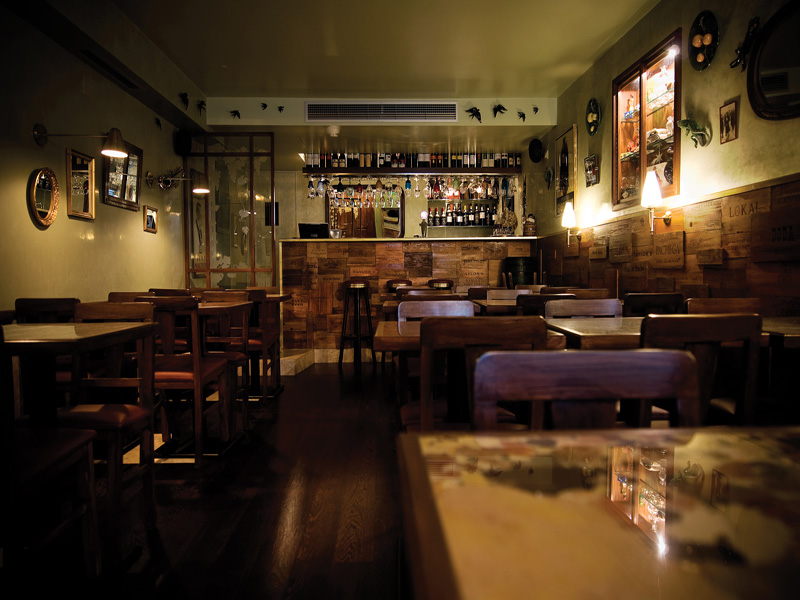
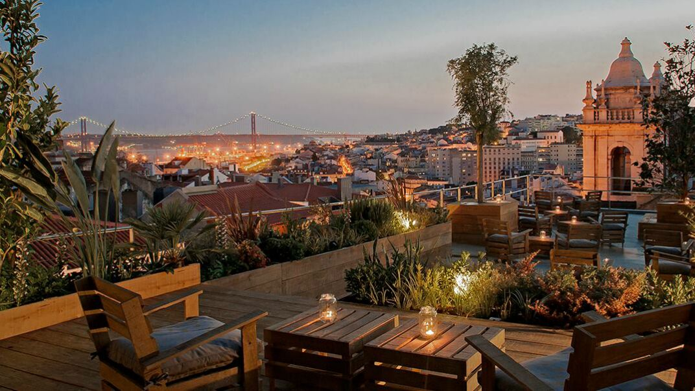

# Lisbon-Tips
A list of stuff to do in Lisbon

### [Pousada Lisboa](https://www.pousadas.pt/pt/hotel/pousada-lisboa)

### [Pestana Palace](https://www.pestana.com/uk/hotel/pestana-palace)

### [Hotel LX Boutique](http://www.lxboutiquehotel.com/en/welcome)

### [Cabaças](https://www.zomato.com/grande-lisboa/casa-cabaças-bairro-alto-lisboa)

### [Cervejaria Ramiro](https://www.zomato.com/grande-lisboa/ramiro-mouraria-lisboa)

### [Pistola y Corazon Taqueria](https://www.zomato.com/grande-lisboa/pistola-y-corazón-taqueria-cais-do-sodré-lisboa)

### [Pinóquio](https://www.zomato.com/grande-lisboa/cervejaria-pinóquio-rossio-lisboa)

### [Rubro](https://www.zomato.com/grande-lisboa/rubro-avenida-avenida-da-liberdade-lisboa)

### [Osteria](https://www.zomato.com/grande-lisboa/osteria-madragoa-lisboa)

### [Casa Nepalesa](https://www.zomato.com/grande-lisboa/casa-nepalesa-praça-de-espanha-lisboa)

### [Taberna da Rua das Flores](https://www.zomato.com/grande-lisboa/taberna-da-rua-das-flores-chiado-lisboa)

### [Artis](https://www.zomato.com/grande-lisboa/artis-bairro-alto-lisboa)

### [Vicente by Carnalentejana](https://www.zomato.com/grande-lisboa/vicente-by-carnalentejana-chiado)

### [Bonsai](https://www.zomato.com/grande-lisboa/bonsai-pr%C3%ADncipe-real)

### [Forno D’oro](https://www.zomato.com/grande-lisboa/forno-doro-rato-lisboa)

### [Ground Burger](https://www.zomato.com/grande-lisboa/ground-burger-praça-de-espanha-lisboa)

### [Cantinho do Aziz](https://www.zomato.com/grande-lisboa/o-cantinho-do-aziz-mouraria-lisboa)

### [Sommelier](https://www.zomato.com/grande-lisboa/sommelier-lisbon-pena-lisboa)

### [Belcanto](https://www.zomato.com/belcanto)

### [Cevicheria](https://www.zomato.com/acevicheria)

### [O Talho](https://www.zomato.com/otalho)

### [Nicolau](https://www.zomato.com/grande-lisboa/nicolau-lisboa-baixa-lisboa)

### [Café Tati](https://www.zomato.com/grande-lisboa/café-tati-cais-do-sodré-lisboa)

### [DeliDeluxe](https://www.zomato.com/Delidelux)

### [Bettina Niccolo Corallo](https://www.zomato.com/grande-lisboa/bettina-e-niccòlo-corallo-pr%C3%ADncipe-real-lisboa)

### [Manteigaria – Fábrica de Pastéis de Nata](https://www.zomato.com/manteigaria)

### [Hello Kristof](https://www.zomato.com/grande-lisboa/hello-kristof-são-bento-lisboa)

### [Copenhagen Coffee Lab ](https://www.zomato.com/grande-lisboa/copenhagen-coffee-lab-pr%C3%ADncipe-real-lisboa)

### [The Mill](https://www.zomato.com/grande-lisboa/the-mill-são-bento-lisboa)

### [Pasteleria Versailles](https://www.zomato.com/grande-lisboa/versailles-saldanha-lisboa)

### [Sky Bar](https://www.zomato.com/grande-lisboa/sky-bar-tivoli-lisboa-avenida-da-liberdade-lisboa)

### [Foxtrot Bar](https://www.zomato.com/grande-lisboa/foxtrot-pr%C3%ADncipe-real-lisboa)

### [Cockpit](https://www.zomato.com/grande-lisboa/cockpit-tapas-gins-campo-pequeno)

### [CINCO Lounge](https://www.zomato.com/grande-lisboa/cinco-lounge-pr%C3%ADncipe-real-lisboa)

### [Pensão Amor](https://www.zomato.com/grande-lisboa/pensão-amor-cais-do-sodré-lisboa)

### [Park](https://www.zomato.com/grande-lisboa/park-bairro-alto-lisboa)

### [Topo Bar](https://www.zomato.com/grande-lisboa/topo-mouraria-lisboa)

### [Rio Maravilha](https://www.zomato.com/grande-lisboa/rio-maravilha-alcântara-lisboa)

